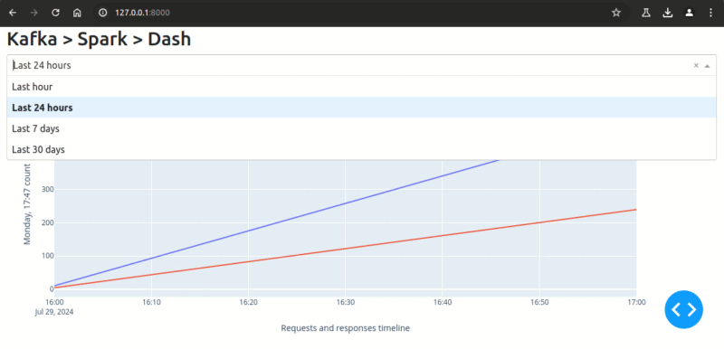

# spark-log-analyser

Spark log analyser, merging http logs with application logs to analyse requests vs responses.

This project delivers an app that merges http and a web app to compare requests and
responses. This project is a POC to consume data from Kafka by a Spark engine,
and deliver a interactive plot using Dash.



_**Note:** this is a v0.1 publication and several project's requirements are to be added in future releases._

### Requisites

To analyse streaming data, a Kafka service is expected to be running and receiving
http and app logs. This app has a test scenario to mock data, in case of need.
[This doc will set up a test env](docs/create-mock-logs.md).

_**Note:** The logic here considers patterns in http and a web app's logs that will certainly differ
from a production environment, to use production htt and app logs,
some Python coding may be required._

## Set up and start

The project's dev env must be set to run this project and [Python Poetry](https://python-poetry.org/docs/)
is used to manage the virtual env. Pip can be used instead:
there is a [requirements.txt](setup/requirements.txt) in the setup directory.

To set the dev env, call:
```shell
make setup-dev
```

### Environment settings

All settings required for this app are in the [env.toml](env.toml) file at the root of the project.
`make` commands are responsible for updating the dynamically created [.env](.env)
on every [Makefile](Makefile) (make) call.

### Start the App

_**Note**: the current version of this project does not check if Kafka is online. If the app starts and raises
errors, check if the broker is up and running._

```shell
make run
```

Have fun!
